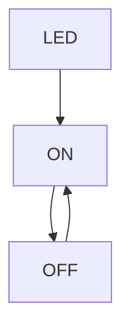

# PRACTICA 1  :  BLINK

## INFORME

### Mi github

* https://github.com/paulamuncu

### Codigo

``` 
#include <Arduino.h>
#define LED 0

void setup() {
  // put your setup code here, to run once:

  Serial.begin(115200);

  pinMode(LED,OUTPUT);
}

void loop() {
  // put your main code here, to run repeatedly:

  delay(500);
  Serial.println("on");
  digitalWrite(LED,HIGH);
  delay(500);
  Serial.println("off");
  digitalWrite(LED,LOW);
}
```
### Diagrama de flujo



### Diagrama de tiempo

```wavedrom
{ signal: [
  { name: "LEVEL",        wave: "1010" },
  { name: "LED",        wave: "3535", data: ["ON", "OFF", "ON", "OFF"] },
]}
```